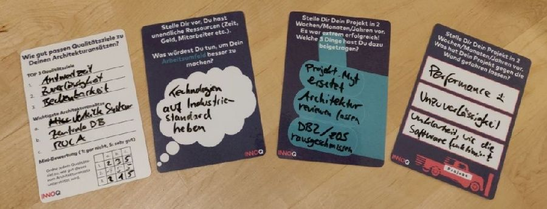

### How do I get the printed cards?

The printed card packs are available at conferences where INNOQ participates (e.g., DeveloperWeek, Goto conference, or JAX).
Markus also offers shipping cards from time to time (at least in his training courses).

### Do you have a file with all cards?

Yes, we have. You can download a PDF file with all cards at once: [cards42 English edition.pdf](../cards42%20English%20edition.pdf)

### How was the idea born?

 Once upon a time, [Markus Harrer](https://twitter.com/feststelltaste) (the initiator and main contributor) went after an internal INNOQ company event to a bookstore and discovered ["50 Karten: Kunterbunte Mitmach-Karten für das Handgepäck"](https://www.usborne.de/usborne-verlag-buecher/katalog/produkt/5/8810/50-karten-kunterbunte-mitmach-karten-fuer-das-handgepaeck/) (rough translation: "50 cards: colorful activity cards for your hand luggage").
 These cards were designed to encourage children to think about various things.
 Markus was heavily inspired by these cards and created the initial idea for "Activity Cards for Software Architects."
 The cards42 project was born.

### Why the name "cards42"?

 With this name, we follow the tradition of [Gernot Starke](https://www.innoq.com/en/staff/gernot-starke/) (INNOQ Fellow) in the naming process. Gernot has already created the projects [arc42](https://arc42.org/) and [aim42](https://www.aim42.org/). He also explained [the origin of the number 42](https://faq.arc42.org/questions/A-1/).

*OK, and of course, the domain was still available ;-)*

### Why is there a logo with "INNOQ" on the cards?

INNOQ is the company where the main contributors are employed.
The company gives the main contributors the time for creating and maintaining the cards42 project.
INNOQ also prints the cards on paper and spreads these cards packs on various occasions.
